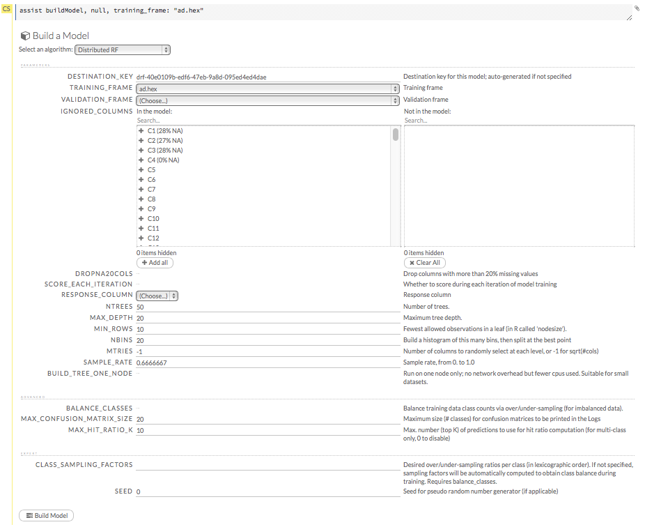
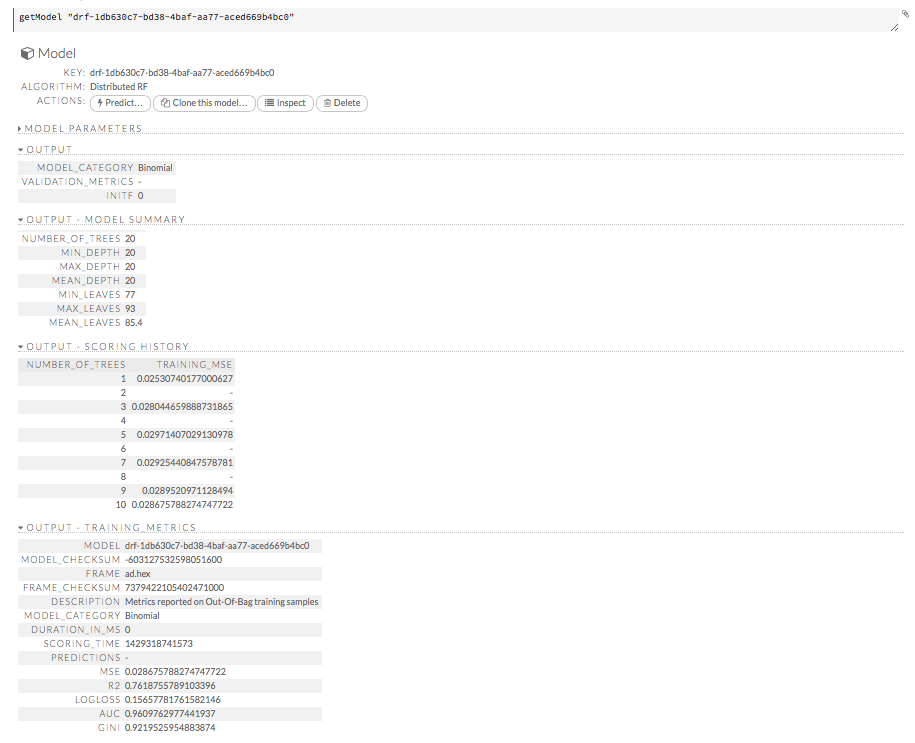
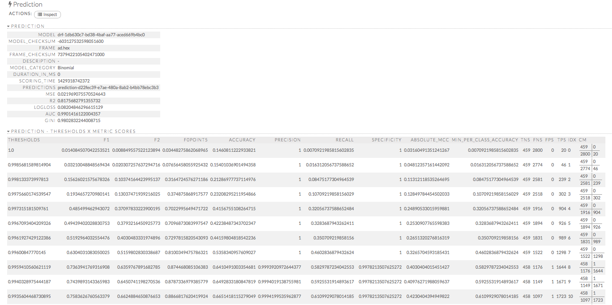

## Random Forest Tutorial

This tutorial describes how to create a Distributed Random Forest (DRF) model using H2O Flow.

Those who have never used H2O before should refer to <a href="https://github.com/h2oai/h2o-dev/blob/master/h2o-docs/src/product/flow/README.md" target="_blank">Getting Started</a> for additional instructions on how to run H2O Flow.

For more details on the math behind H2O's implementation of Random Forest, refer to <a href="http://docs.h2o.ai/datascience/rf.html" target="_blank">RF Data Science</a>. 

### Getting Started

This tutorial uses a publicly available data set that can be found at <a href ="http://archive.ics.uci.edu/ml/machine-learning-databases/internet_ads/" target="_blank">http://archive.ics.uci.edu/ml/machine-learning-databases/internet_ads/</a>

The data are composed of 3279 observations, 1557 attributes, and an a priori grouping assignment. The objective is to build a prediction tool that predicts whether an object is an internet ad or not.

To further explore H2O's capabilities, some <a href="http://docs.h2o.ai/resources/publicdata.html" target="_blank">publicly available data sets</a> can be found on our website. 

####Importing Data
Before creating a model, import data into H2O:

0. Click the **Assist Me!** button in the *Help* tab in the sidebar on the right side of the page. 
 

0. Click the **importFiles** link and enter the file path to the dataset in the **Search** entry field, or drag and drop the file onto the **Search** entry field and press Enter to confirm the file drop.  
0. Click the **Add all** link to add the file to the import queue, then click the **Import** button. 

  

####Parsing Data
Now, parse the imported data: 

0. Click the **Parse these files...** button. 

  **Note**: The default options typically do not need to be changed unless the data does not parse correctly. 

0. From the drop-down **Parser** list, select the file type of the data set (Auto, XLS, CSV, or SVMLight). 
0. If the data uses a separator, select it from the drop-down **Separator** list. 
0. If the data uses a column header as the first row, select the **First row contains column names** radio button. If the first row contains data, select the **First row contains data** radio button. To have H2O automatically determine if the first row of the dataset contains column names or data, select the **Auto** radio button. 
0. If the data uses apostrophes ( `'` - also known as single quotes), check the **Enable single quotes as a field quotation character** checkbox. 
0. To delete the imported dataset after parsing, check the **Delete on done** checkbox. 

  **NOTE**: In general, we recommend enabling this option. Retaining data requires memory resources, but does not aid in modeling because unparsed data can’t be used by H2O.

0. Review the data in the **Data Preview** section, then click the **Parse** button.  

  

  **NOTE**: Make sure the parse is complete by clicking the **View Job** button and confirming progress is 100% before continuing to the next step, model building. For small datasets, this should only take a few seconds, but larger datasets take longer to parse.

### Building a Model

0. Once data are parsed, click the **View** button, then click the **Build Model** button. 
0. Select `Distributed RF` from the drop-down **Select an algorithm** menu, then click the **Build model** button. 
0. If the parsed ad.hex file is not already listed in the **Training_frame** drop-down list, select it. Otherwise, continue to the next step. 
0. From the **Response column** drop-down list, select `C1`. 
0. In the **Ntrees** field, specify the number of trees for the model to build. For this example, enter `150`. 
0. In the **Max_depth** field, specify the maximum distance from the root to the terminal node. For this example, use the default value of `20`. 
0. In the **Mtries** field, specify the number of features on which the trees will be split. For this example, enter `1000`. 
0. Click the **Build Model** button. 

   

### RF Output

The DRF model output includes the following: 

- Output (model category, validation metrics, initf)
- Model summary (number of trees, min. depth, max. depth, mean depth, min. leaves, max. leaves, mean leaves)
- Scoring history (number for each tree and MSE)
- Training metrics (model name, model checksum, frame name, frame checksum, description if applicable, model category, duration in ms, scoring time, predictions, MSE, R2, Logloss, AUC, Gini)
- Training metrics (thresholds, F1, F2, F0Points, Accuracy, Precision, Recall, Specificity, Absolute MCC, min. per-class accuracy, TNS, FNS, FPS, TPS, IDX)
- Maximum metrics (metric, threshold, value, IDX)
- Variable importances (variable name, relative importance, scaled importance, percentage)

  

### RF Predict

To generate a prediction, click the **Predict** button in the model results and select the `ad.hex` file from the drop-down **Frame** list, then click the **Predict** button. 

  

To view the prediction, click the **View Prediction Frame** button. You can also click the **Inspect** button to access more information (for example, columns or data). 

  

